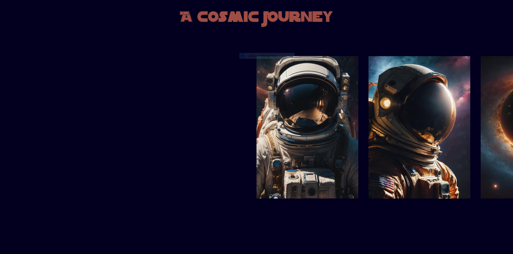
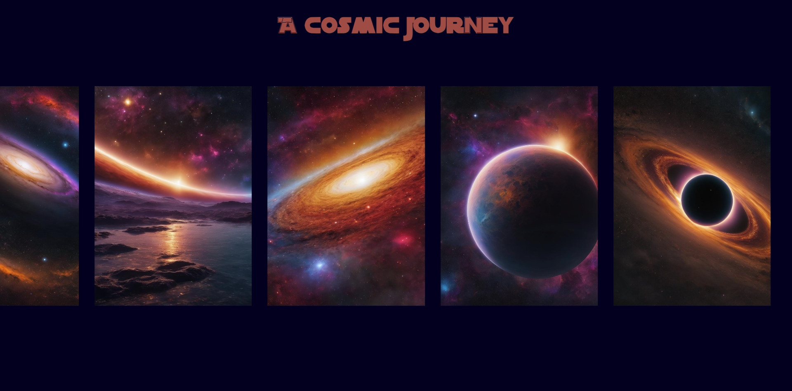
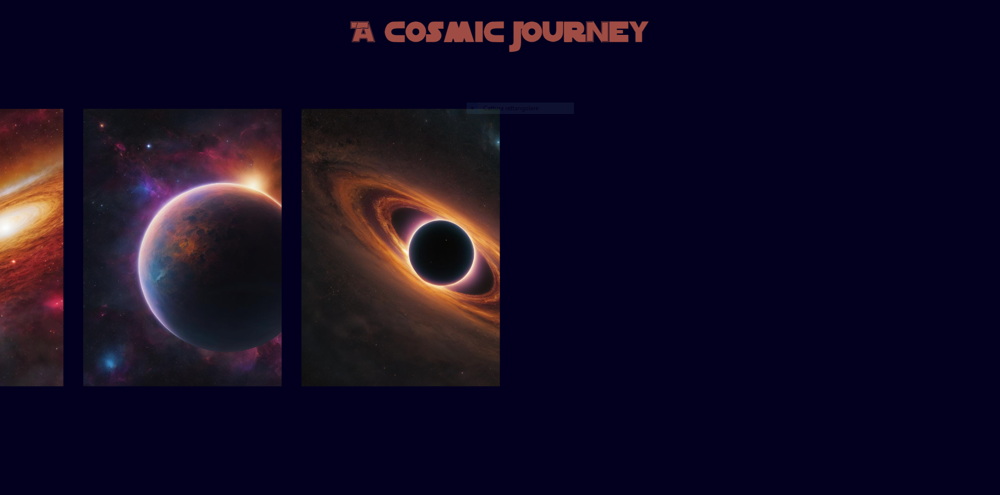

# A COSMIC JOURNEY
The goal of this project was to create an image slider with cool animations by using javascript.
I used AI generated images, then I animated everything with vanilla Javascript.

### The project:
 
 
The slider works like this: by using the cursor, while pointing in every point of the screen, you can slide the images left to right or right to left as you wish. 
 

 
Also, the images itself move in a relative motion while dragged, causing a parallax effect.

